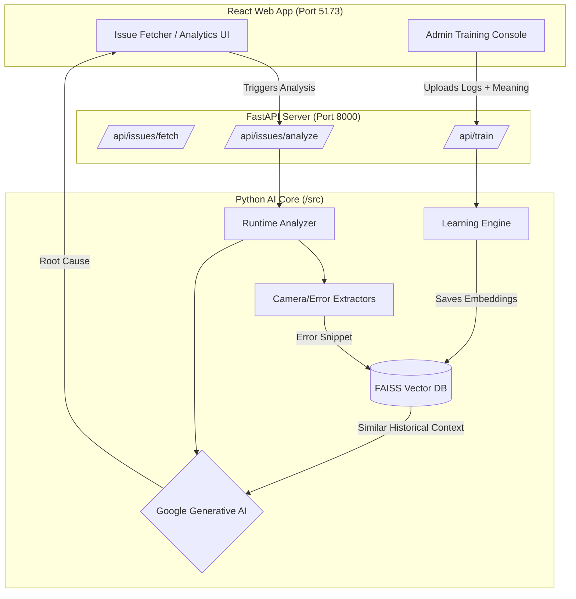

# Log Filter AI - Complete AI Handoff & Architecture Document

**Welcome, AI Agent!** You are taking over the ongoing development of the **Log Filter AI** project. This document contains the full context, overarching goals, architectural breakdown, and next steps required to successfully build out this tool.

---

## 🎯 The Overarching Goal
The goal of the **Log Filter AI** is to drastically reduce the man-hours required by engineers to debug complex system issues (e.g., Android Camera crashes, ISP node failures, NullPointerExceptions) by automating log analysis. 

Instead of an engineer manually skimming through thousands of lines of `logcat` and `dumpstate` files, this tool:
1. Automatically extracts relevant log windows (e.g. 5 lines before/after a crash).
2. Uses **Vector Embeddings (FAISS)** to search historical, human-trained issues.
3. Passes the historical context and current logs into an **LLM via Agentic RAG**.
4. Generates an instant, highly accurate Root Cause Analysis for the engineer via a modern web interface.

A critical part of this system is the **Admin Training Loop**, which allows administrators to manually upload new logs and define their root causes, effectively making the AI smarter over time.

---

## 🏗️ System Architecture

The project is structured as a monolithic repository containing a **Vite/React frontend** and a **FastAPI/Python backend**.

---

## 📂 Codebase Deep Dive

### 1. The AI Backend Core (`/src`)
This is the brains of the operation.
*   **`/src/analyzer/runtime_analyzer.py`**: The main orchestrator for analysis. It takes a raw `dumpstate` file, calls the `CameraExtractor` and `ErrorExtractor` to find crashes, checks the `VectorDB` for similar embeddings, and uses the `RootCauseAnalyzer` (LLM) to classify the issue.
*   **`/src/trainer/`**: Contains the learning engine. Scripts here take raw logs and human-provided meanings, compress them into `template.json` files using the LLM (`llm_template_gen.py`), and inject them into the vector database.
*   **`/src/vectors/`**: Wrappers around `faiss-cpu` to handle fast semantic search of past logs.

### 2. Configuration & Persona (`/config`)
*   **`/config/domain_knowledge.txt`**: This is a critical file. It contains the complete system preamble injected into the `RootCauseAnalyzer` LLM. By default, it sets up an Android Camera expert persona, but **at setup time, users can overwrite this file** to make the AI an expert in Audio, Network, or any other domain, without touching Python code.

### 3. The FastAPI Server (`/src/server/main.py`)
This serves as the bridge between the AI Core and the React frontend.
*   Currently handles CORS for `localhost:5173`.
*   Houses three main endpoints: `/api/issues/fetch`, `/api/issues/analyze`, and `/api/train`.

### 4. The React Web App (`/web-app`)
A heavily polished, modern SaaS interface designed for engineers and admins.
*   **State Management**: Complex UI states (Dark/Light mode, S/M/L global text scaling, active tabs, Admin auth) are entirely managed in `App.jsx` and persisted across reloads using browser `localStorage`.
*   **Styling (`index.css`)**: Built without external UI libraries. Uses native CSS variables for theme switching, dynamic `clamp()` and `rem` units for aggressive layout responsiveness, and modern glassmorphism/pill-tab aesthetics.
*   **Admin Console**: A secure (currently mock-password protected via `admin123`) UI segment that allows admins to upload `multipart/form-data` (raw logs, `.zip` dumps) and type out the root cause to train the AI.

---

## 🚦 Current Project Status

| Component | Status | Details |
| :--- | :--- | :--- |
| **Frontend UI/UX** | **Complete** | Theme, text-scaling, persistent state, responsive tables, and forms are fully built and polished. |
| **Admin Training UI** | **Complete** | Password-protected console supports attaching multiple files and defining new issue clusters. |
| **Dynamic Persona** | **Complete** | `config/domain_knowledge.txt` allows full, code-free overwriting of the AI's system prompt and domain expertise. |
| **Backend Endpoints** | **Stubbed** | `fetch`, `analyze`, and `train` endpoints exist in FastAPI and accept correct payloads, but return mock data. |
| **AI Python Core** | **Written, but Unlinked** | The `RuntimeAnalyzer` and `Trainer` logic exists in `/src`, but they have **not** been imported or wired up to the FastAPI endpoints. |

---

## 🚀 Immediate Next Steps (Your Mission)

When you take over, focus on these immediate integration tasks:

1.  **Wire the Trainer (`/api/train`)**
    *   **Goal**: Replace the `asyncio.sleep(1)` stub in `/api/train` with actual logic from `/src/trainer/`.
    *   **Action**: When an admin submits the `multipart/form-data` via the Training Console, process the uploaded `UploadFile` objects, pass the human-written `meaning` into the `Trainer` module, generate an embedding, and save the resulting template to the FAISS DB.

2.  **Wire the Analyzer (`/api/issues/analyze`)**
    *   **Goal**: Replace the stub in `/api/issues/analyze`.
    *   **Action**: When the user clicks "Analyze" on an issue, trigger `RuntimeAnalyzer.analyze_dumpstate()`, wait for the LLM to generate the root cause, and stream/return the actual findings to the React UI instead of the mock success message.

3.  **Build Real Analytics**
    *   **Goal**: The `totalAnalyzed` and `manHoursSaved` metrics in the UI are currently hardcoded.
    *   **Action**: Create a `GET /api/analytics` endpoint that queries a real database (or reads execution logs) to calculate the actual success rate and man-hours saved, then update `App.jsx` to fetch this data.
