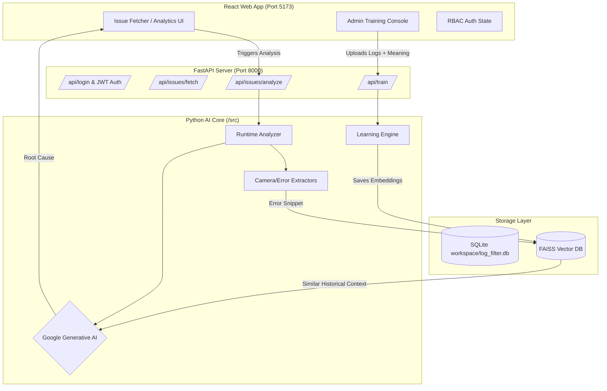

# Log Filter AI - Complete AI Handoff & Architecture Document

**Welcome, AI Agent!** You are taking over the ongoing development of the **Log Filter AI** project. This document contains the full context, overarching goals, architectural breakdown, and next steps required to successfully build out this tool.

---

## 🎯 The Overarching Goal
The goal of the **Log Filter AI** is to drastically reduce the man-hours required by engineers to debug complex system issues (e.g., Android Camera crashes, ISP node failures, NullPointerExceptions) by automating log analysis. 

Instead of an engineer manually skimming through thousands of lines of `logcat` and `dumpstate` files, this tool:
1. Automatically extracts relevant log windows (e.g. 5 lines before/after a crash).
2. Uses **Vector Embeddings (FAISS)** to search historical, human-trained issues.
3. Passes the historical context and current logs into an **LLM via Agentic RAG**.
4. Generates an instant, highly accurate Root Cause Analysis for the engineer via a modern web interface.

A critical part of this system is the **Admin Training Loop**, which allows administrators to manually upload new logs and define their root causes, effectively making the AI smarter over time.

---

## 🏗️ System Architecture

The project is structured as a monolithic repository containing a **Vite/React frontend** and a **FastAPI/Python backend** backed by **SQLite**.

---

## 📂 Codebase Deep Dive

### 1. The AI Backend Core (`/src`)
This is the brains of the operation.
*   **`/src/analyzer/runtime_analyzer.py`**: The main orchestrator for analysis. It takes a raw `dumpstate` file, calls the `CameraExtractor` and `ErrorExtractor` to find crashes, checks the `VectorDB` for similar embeddings, and uses the `RootCauseAnalyzer` (LLM) to classify the issue.
*   **`/src/trainer/`**: Contains the learning engine. Scripts here take raw logs and human-provided meanings, compress them into `template.json` files using the LLM (`llm_template_gen.py`), and inject them into the vector database.
*   **`/src/vectors/`**: Wrappers around `faiss-cpu` to handle fast semantic search of past logs.

### 2. Configuration & Utilities (`/config` & `/src/utils`)
*   **`/config/domain_knowledge.txt`**: This is a critical file. It contains the complete system preamble injected into the `RootCauseAnalyzer` LLM. By default, it sets up an Android Camera expert persona, but **at setup time, users can overwrite this file** to make the AI an expert in Audio, Network, or any other domain, without touching Python code.
*   **`/src/utils/logger.py`**: A centralized debugging system. By running `start_app.ps1 -Debug`, the system outputs verbose Python and FAISS logs to the terminal.

### 3. The FastAPI Server & Database (`/src/server/`)
This serves as the bridge between the AI Core and the React frontend.
*   **`main.py`**: Houses the REST endpoints and a background `issue_poller_task` that randomly generates mock issues for testing.
*   **`database.py`**: SQLAlchemy configuration pointing to `workspace/log_filter.db`. Includes models for `User`, `Issue`, and `IPSession`.
*   **`auth.py`**: JWT Authentication layer enforcing **RBAC (SUPER_ADMIN, EDITOR, VIEWER)**. Supports auto-login based on tracked IP Addresses.

### 4. The React Web App (`/web-app`)
A heavily polished, modern SaaS interface designed for engineers and admins.
*   **State Management**: Complex UI states (Dark/Light mode, S/M/L global text scaling, active tabs, Admin auth) are entirely managed in `App.jsx` and persisted across reloads using browser `localStorage`.
*   **Styling (`index.css`)**: Built without external UI libraries. Uses native CSS variables for theme switching, a sleek radial gradient for Light Mode, and modern glassmorphism/pill-tab aesthetics.
*   **Admin Console & Auth**: Full RBAC integration. Viewers cannot see or trigger the fetcher tools. Super Admins can manage users and reset passwords.

---

## 🚦 Current Project Status

| Component | Status | Details |
| :--- | :--- | :--- |
| **Frontend UI/UX** | **Complete** | Theme, radial gradient, persistent state, responsive tables, and forms are fully built and polished. |
| **Authentication & RBAC**| **Complete** | Full JWT + IP Session autologin. Secure `SUPER_ADMIN`, `EDITOR`, and `VIEWER` separation. |
| **Database Integration** | **Complete** | SQLite (`log_filter.db`) backing user accounts and timestamped issue creation. |
| **Admin Training UI** | **Complete** | Role-protected console supports attaching multiple files and defining new issue clusters. |
| **Dynamic Persona** | **Complete** | `config/domain_knowledge.txt` allows full, code-free overwriting of the AI's system prompt and domain expertise. |
| **Analyzer Engine** | **Complete** | The `RuntimeAnalyzer` is wired to the frontend. It runs in a FastAPI threadpool, fetches LLM findings, and renders them in a React modal. |
| **Trainer Engine** | **Complete** | The `TrainerOrchestrator` executes the learning pipeline, converting admin inputs into LLM templates and injecting them into the FAISS vector DB. |
| **Analytics Dashboard**| **Complete** | Records live metrics. Features **System Influx** tracking and **Top Recurring Issues** leaderboards (Today, This Week, This Month). |
| **Logging & DevOps** | **Complete** | Centralized debug logging accessible via `.\start_app.ps1 -Debug`. |

---

## 🚀 Immediate Next Steps (Your Mission)

*All core MVP integrations (Analyzer, Trainer, Auth, Database, and Analytics) are complete! The Python AI Core, FastAPI Backend, and React Frontend are fully wired up and functional.*

Future enhancements could include:
1. Hosting the backend, SQLite, and VectorDB on a cloud provider.
2. Expanding the AI persona support to handle non-text logs (e.g., visualizing binary memory dumps).
3. Implementing proper pagination and filtering on the frontend issue tables.

---
*End of Handoff Document. You've got this!*
